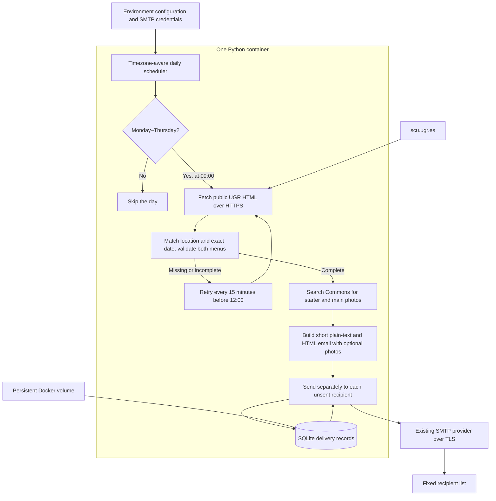

# UGR Comedor Daily architecture

Status: design documented and implemented, including the Friday-through-Sunday exclusion. Automated tests pass against a saved real UGR page and simulated email delivery. The container builds locally; resource measurement and a real SMTP delivery remain deployment checks.

## Requirements

- Check the public UGR page at 09:00 Europe/Madrid, following daylight-saving time.
- Select only the current calendar date's Fuentenueva / Cartuja / Aynadamar menus.
- Include both menu options in a short English newsletter with the original Spanish dish names.
- Send Monday through Thursday only. Never send Friday through Sunday, including through a manual send command.
- On other days, send only when that exact date has a complete published menu. Do not infer closure from the weekday alone.
- Deliver privately to a fixed recipient list configured by the operator.
- Run as one small container on an always-on machine with Docker Compose.

## Architecture

## Technology decisions

| Area | Choice | Reason |
| --- | --- | --- |
| Language | Python 3.14 | Small, readable application; everything required is in the standard library. |
| Container | Official Python Alpine image | Compact Linux runtime with no compiler, browser or web server required. |
| Deployment | Docker Compose | One service, one persistent volume and one configuration file. |
| Fetching | `urllib.request` with HTTPS | No HTTP client dependency; bounded response size and timeout. |
| Parsing | `html.parser.HTMLParser` | The real page exposes headings and menu tables directly in HTML. No JavaScript rendering needed. |
| Images | Wikimedia Commons Action API via `urllib.request` | Fresh searches per newsletter, no account or dependencies; thumbnails and attribution returned together. |
| Scheduling | `datetime`, `zoneinfo`, interruptible sleep | Local 09:00 scheduling with daylight-saving support, without a separate cron process. |
| Email | `email.message`, `smtplib`, `ssl` | Standard MIME emails and verified SMTP TLS; works with an existing SMTP account. |
| Delivery state | `sqlite3` | Durable per-date, per-location, per-recipient records without a database service. |
| Verification | `unittest` and `unittest.mock` | Real-page parser fixtures and simulated delivery failures without sending email. |

There are no third-party Python libraries. The image installs timezone data and CA certificates. Start with a 64 MiB container memory limit and verify it during container testing; this is a target, not a measured result.

Python is preferred here for maintainability and its built-in mail, parsing and database support. A compiled Go service could reduce the runtime footprint further, but does not justify the extra implementation work for this small daily workload. Requests, Beautiful Soup, APScheduler, Redis and browser automation are unnecessary for the current page and schedule.

## Daily behavior

1. Check the Madrid calendar date and skip Friday through Sunday before fetching or sending. Apply this same rule to manual delivery.
2. At 09:00, read the delivery records. If all configured recipients already received today's menu, finish for the day.
3. Fetch the page and match both the campus section and the complete date, including year. UGR repeats sections for different dates and publishes PTS separately.
4. Require both menus and their starter, main, side and dessert. Preserve multiple rows of a course when present. Never fall back to yesterday or another campus.
5. Search Commons for each distinct starter and main, then send a concise email to each unsent recipient, with optional credited photos and a link to UGR for allergens and updates. Share the search results across recipients; image failures leave dishes text-only.
6. Record each successful SMTP acceptance immediately. Retry temporary fetch failures, missing/incomplete menus and failed recipients every 15 minutes before 12:00.
7. After the cutoff, stop trying for that date. Do not send old newsletters the next day.

If the service restarts between 09:00 and 12:00 on Monday through Thursday, it catches up for the current day. Before 09:00 it waits; after 12:00 or from Friday through Sunday it waits for the next eligible day. The host must remain powered on and have internet access.

## Reliability and limits

- The Docker volume survives container replacement. Removing it also removes duplicate-send protection.
- SQLite serializes concurrent sends sharing the same volume. Run one scheduled instance.
- A failure for one recipient does not resend to recipients already recorded as successful.
- SMTP acceptance is not proof of inbox delivery. A crash after SMTP acceptance but before recording it can cause a duplicate on retry; plain SMTP cannot guarantee exactly-once delivery.
- Layout changes or incomplete data should fail closed and appear in logs, with retries inside the morning window.
- Logs rotate and avoid recipient addresses and SMTP secrets. Docker restarts the worker if it exits.
- No inbound ports are required. Use a non-root process and read-only container filesystem, with only the delivery volume writable.

## Configuration and commands

Configure SMTP host, port, TLS mode, sender, credentials and comma-separated recipients in an ignored `.env` file. Support a mounted password file as an alternative. Default to Europe/Madrid, 09:00 and the main campus group. The Friday-through-Sunday exclusion is a fixed business rule.

Keep `TEST_RECIPIENTS` separate from the normal list. The explicit test command sends only to that list, adds a `[TEST]` subject prefix, bypasses weekday and duplicate checks, and never reads or writes delivery records.

`IMAGE_SEARCH_ENABLED` defaults to true. Daily sends and test sends look up photos afresh using the Spanish dish names and, for longer names, a shorter query retaining dietary qualifiers. Image selection requires matching words, prepared-food context, permitted thumbnail hosts, and complete attribution under CC BY, CC BY-SA or CC0. No English dish descriptions are generated. The HTML newsletter labels photos as illustrative and links credits and licenses; its text counterpart remains unchanged. Queries have five-second request timeouts and a 30-second batch budget checked between requests. Up to eight distinct dishes are queried, with no more than two searches per dish. Errors and unmatched dishes do not block delivery. There is no persistent photo catalogue or separate image service to deploy.

- `preview`: show a live or saved menu without SMTP credentials, delivery records or sending. Allow a chosen historical date for parser verification, including Friday through Sunday.
- `run`: operate the daily scheduler.
- `once`: explicitly send the current day's menu now, honoring the Friday-through-Sunday exclusion and existing delivery records. This command may bypass the time window, but cannot send a historical menu.
- `test-email`: send today's menu to `TEST_RECIPIENTS` on demand without weekday or duplicate restrictions and without changing delivery records.

## Validation before deployment

Test the saved real UGR HTML for exact date selection, repeated sections, PTS isolation, multiple side dishes, missing days, incomplete menus and changed markup. Test Friday-through-Sunday blocking in scheduled and manual sends, unrestricted repeatable sends only to test recipients, Madrid daylight-saving transitions, morning catch-up, noon cutoff, persistence across restarts and partial recipient failures. Verify TLS setup, private recipient headers and HTML escaping using a fake SMTP transport.

Then build and exercise the actual container, inspect resource usage and verify persistent volume permissions. A real email test requires the operator's SMTP credentials and a chosen recipient; none have been provided yet. Docker is installed in the current workspace environment, but its daemon was not running when checked.
